# 🍣 Uminoo Hikari - Restaurant Order Management System

> **Group 12** - Software Engineering Project  
> **University of Transport Ho Chi Minh City (UTH)**

## 📖 Project Overview
**Uminoo Hikari** is a comprehensive web-based application designed to streamline operations for Japanese restaurants. The system digitizes the entire dining experience, from online table reservations to QR-code ordering at the table, kitchen management, and automated billing.

---

## 🚀 Key Features

### 1. For Visitors (Guest)
* **View Restaurant Info:** Access general information, menus, and promotions.
* **Online Reservation:** Book tables in advance by providing details (Name, Phone, Party Size, Time).

### 2. For Customers (At Table)
* **QR Code Ordering:** Scan a QR code to access the digital menu.
* **Smart Menu:** View items with images/prices, filter by category.
* **Request Payment:** Call for the bill directly from the app.

### 3. For Staff & Admin
* **Table Map View:** Real-time visual layout of tables with status (White: Available, Blue: Occupied).
* **Menu Management:** Add/Edit/Delete food items, categories.
* **Dashboard:** View real-time statistics (Revenue, Orders).

---

## 🛠 Tech Stack

* **Frontend:** ReactJS / Vite
* **Backend:** Python Django
* **Database:** MySQL
* **Deployment:** Docker & Docker Compose
* **Tools:** GitHub, Jira, Diagrams.net

---

## ⚙️ Installation & Setup

### Prerequisites
* [Docker Desktop](https://www.docker.com/products/docker-desktop) installed.
* Git installed.

### Steps to Run
1.  **Clone the repository:**
    ```bash
    git clone [https://github.com/VannTruongg06/CNPM_UTH_Nhom-12.git](https://github.com/VannTruongg06/CNPM_UTH_Nhom-12.git)
    cd CNPM_UTH_Nhom-12
    ```

2.  **Run with Docker Compose:**
    ```bash
    cd Stage_3_and_4
    docker-compose up --build
    ```

3.  **Access the Application:**
    * **Frontend:** `http://localhost:3000` (or port 80)
    * **Backend API:** `http://localhost:8000`

---

## 📐 System Architecture

### DATA FLOW DIAGRAM (DFD) 
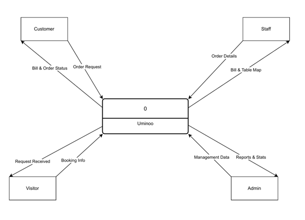
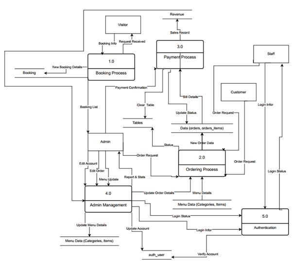
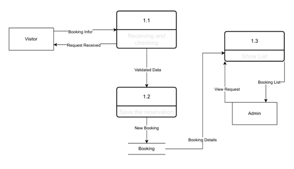
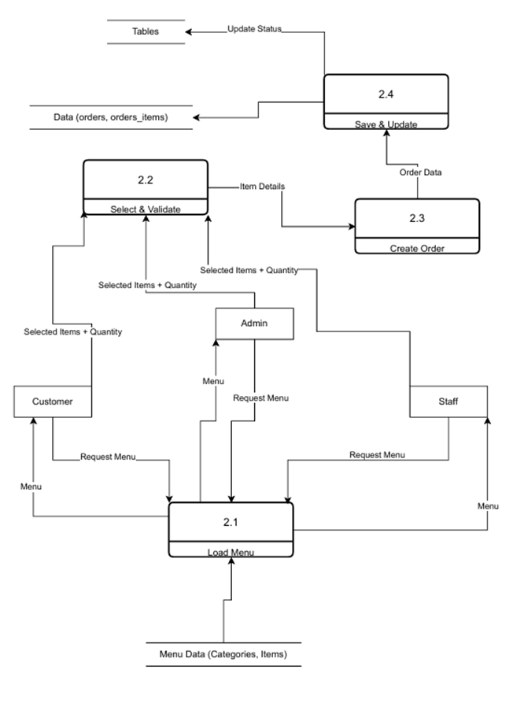
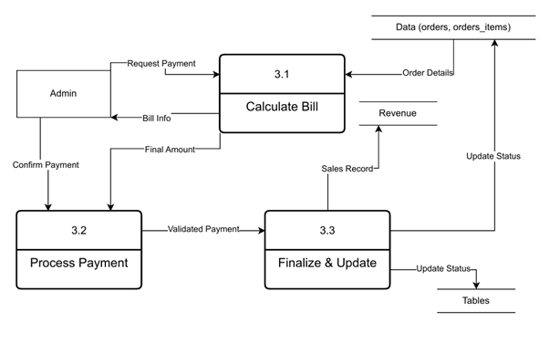
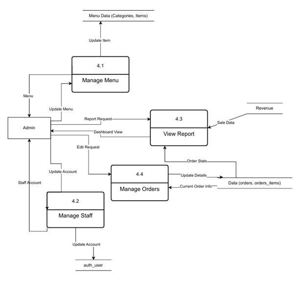

### Use Case Diagram
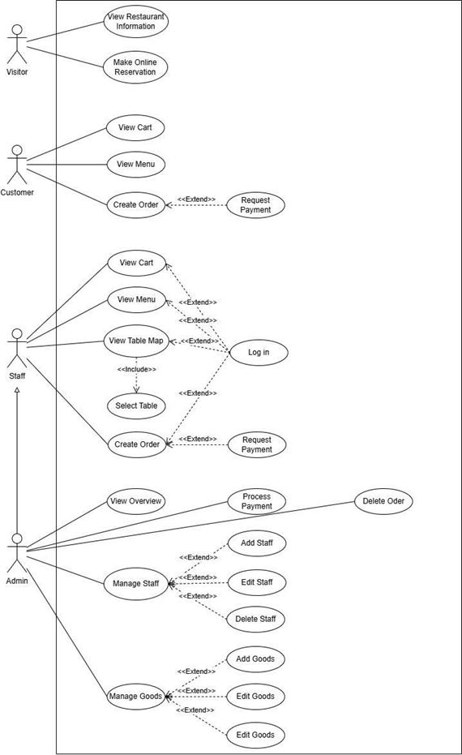

### CLASS DIAGRAM
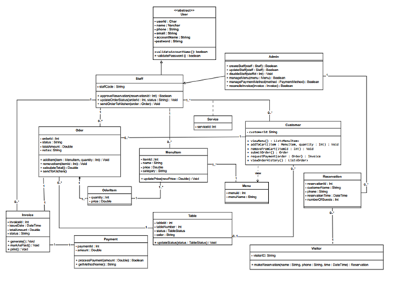

### Database Schema (ERD)
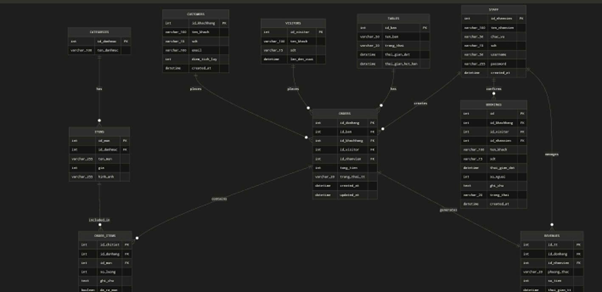

---

## 📸 Screenshots

### 1. Online Reservation (Visitor)
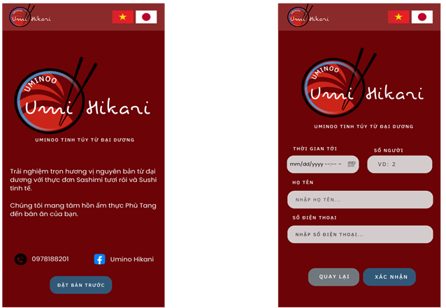

### 2. Mobile Ordering (Customer)
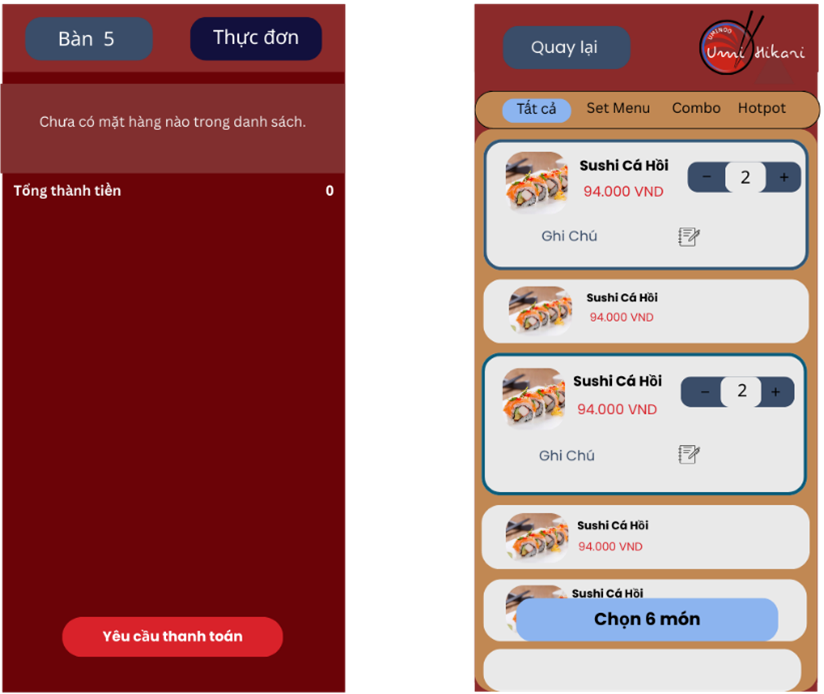
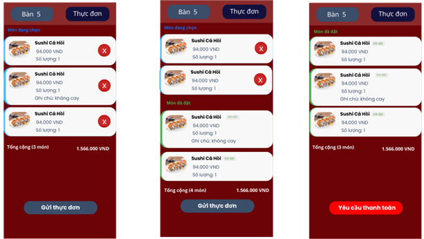

### 2. Mobile Ordering (Staff)
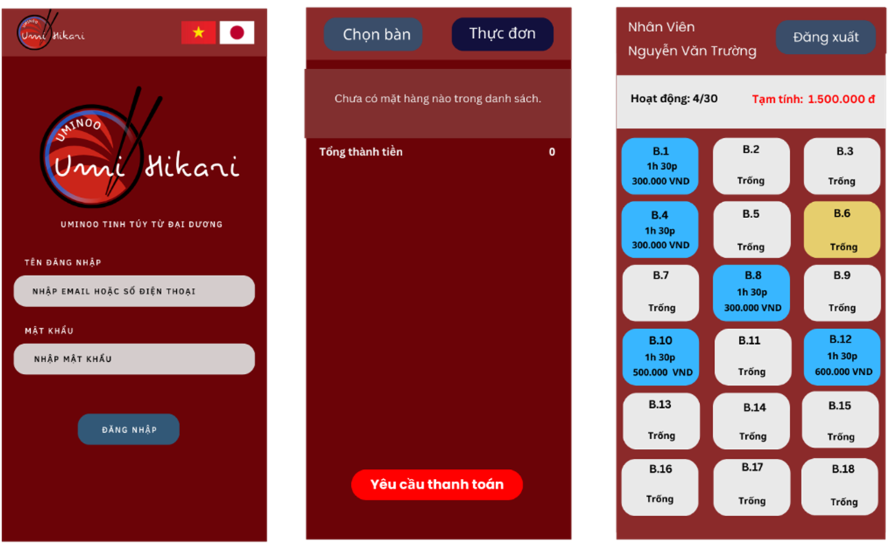

### 3. Admin 
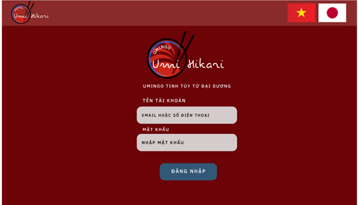
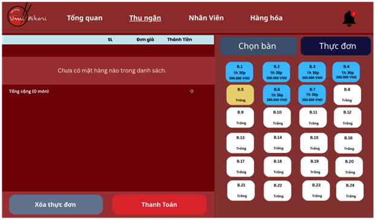
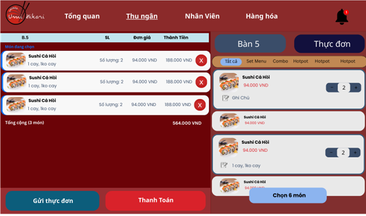
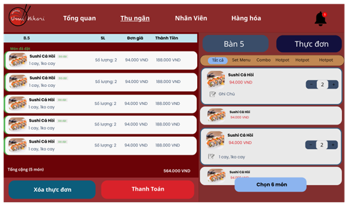
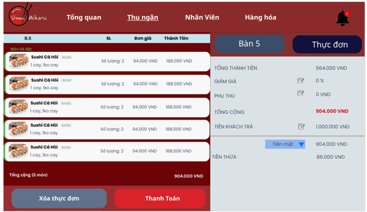
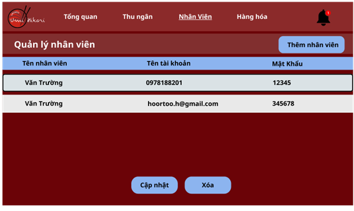
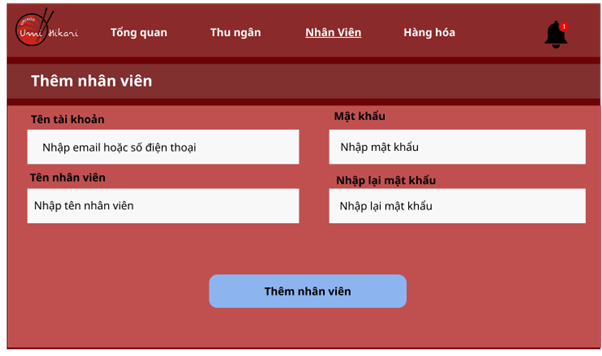
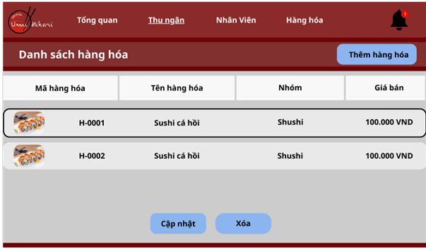
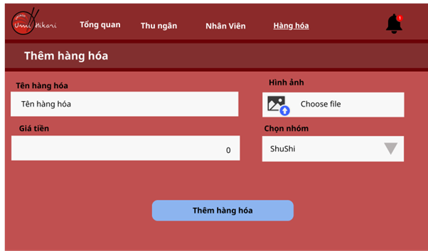
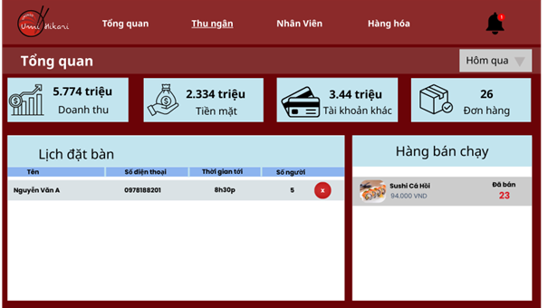

---

## 👥 Team Members (Group 12)

| Role | Name | Contribution |
| :--- | :--- | :--- |
| **Leader** | Nguyen Van Truong |  Frontend, UI/UX |
| **Member** | Nguyen Ngoc Minh Tuan | Frontend, UI/UX |
| **Member** | Nguyen Xuan Truong | Backend, Database |
| **Member** | Pham Tuan | Backend, Database |
| **Member** | Huynh Le Bao Tram | Backend, Database |
| **Group-12** | Group 12 | Testing, Document |

---

## 📝 License
This project is developed for the **Software Engineering** course at **Ho Chi Minh City University of Transport (UTH)**.

